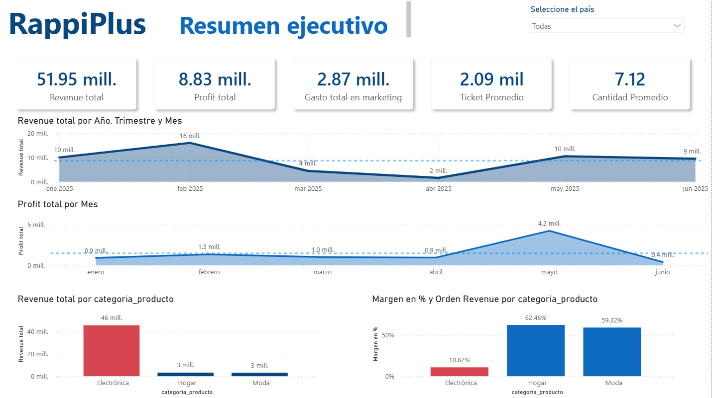
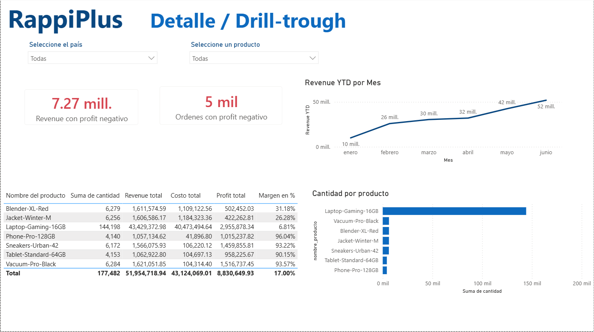
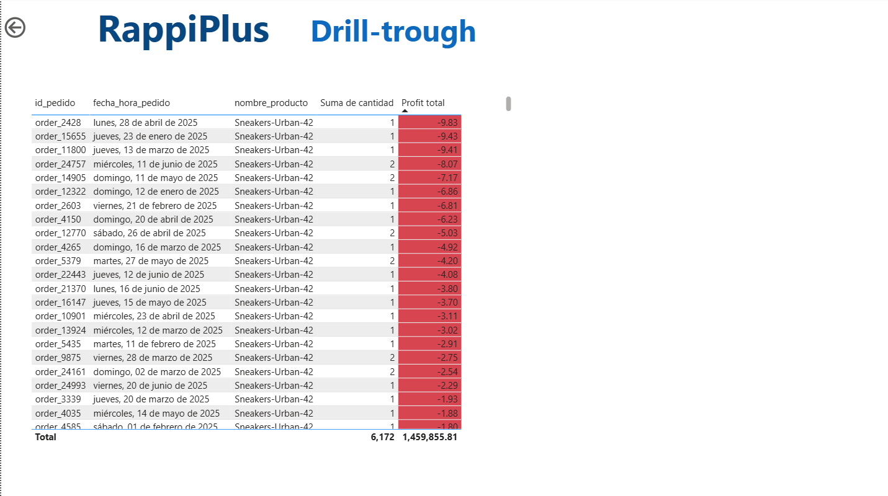
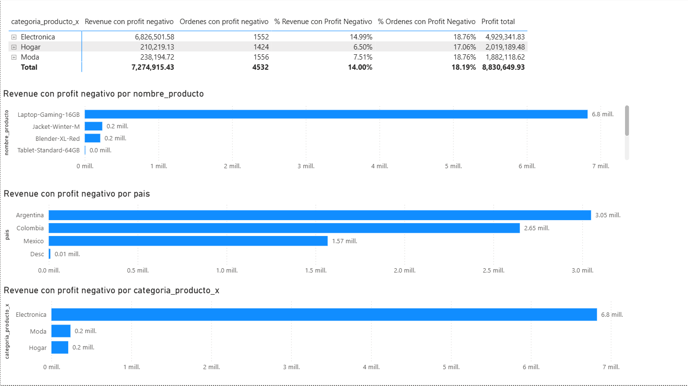
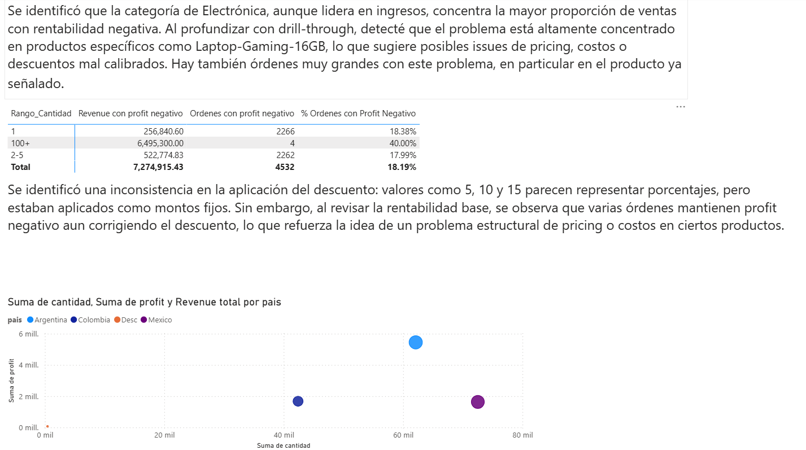
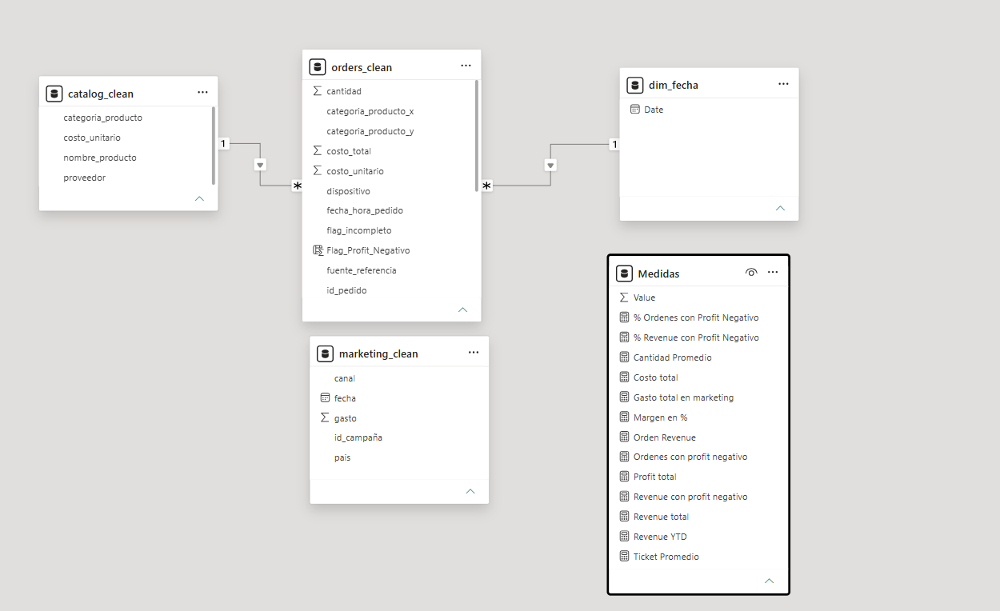

# 📊 RappiPlus Business Analytics Project

End-to-end business analytics project developed to evaluate the performance of **RappiPlus**, a subscription service designed to increase purchase frequency and customer value within the Rappi ecosystem.

The project combines **Python, SQL, statistical analysis, and Power BI** to assess business profitability, user behavior, retention, conversion funnel performance, and product experimentation impact.

---

## 📌 Business Problem

The business team needed to understand whether **RappiPlus** was achieving its intended objectives.

Key business questions included:

- Can we trust the data?
- Is the business profitable?
- Where are users dropping off?
- Are users returning?
- Are product changes generating measurable impact?
- How can insights be communicated clearly?

---

## 🛠 Tools & Technologies

- Python
- Pandas
- NumPy
- SQL
- PostgreSQL
- Power BI
- DAX
- Power Query
- Statistical Testing
- Cohort Analysis
- Funnel Analysis
- Data Modeling

---

## 🔍 Project Workflow

### 1. Data Quality & Preparation (Python)

Three main datasets were analyzed and cleaned:

- Orders
- Catalog
- Marketing Spend

Key activities included:

- Data cleaning and transformation
- Missing value handling
- Duplicate detection
- Data type validation
- Data consistency checks
- Categorical normalization
- Dataset preparation for analysis

---

### 2. Profitability Analysis (Python + Power BI)

Key business KPIs were calculated:

- Total Revenue
- Total Profit
- Marketing Spend
- Average Ticket
- Average Quantity
- Profit Margin

### Key Finding

Although **Electronics** generated the highest revenue, it also concentrated the highest proportion of negative profitability, indicating a potential structural issue.

---

### 3. Funnel Conversion Analysis (SQL)

User journey analysis was performed to identify conversion bottlenecks:

- First Visit
- Product Selection
- Add to Cart
- Begin Checkout
- Add Payment Information
- Purchase

Objective:

Identify user drop-off points and uncover opportunities to improve conversion performance.

---

### 4. Cohort Retention Analysis (SQL)

Cohort analysis was developed to evaluate:

- User recurrence
- Temporal behavior
- Retention patterns
- Platform engagement over time

---

### 5. A/B Testing (Statistical Analysis)

Statistical experimentation was conducted to evaluate product changes.

Activities included:

- Hypothesis testing
- Variant comparison
- Statistical significance analysis
- Business recommendation generation

Objective:

Determine whether product modifications generated a statistically significant impact on conversion.

---

### 6. Executive Dashboard (Power BI)

An interactive Power BI dashboard was developed to support business decision-making through:

- KPI monitoring
- Time-series analysis
- Profitability by category
- Country comparison
- Negative order drill-through
- Business anomaly detection

---

## 🖼 Dashboard Preview

### Executive Overview Dashboard

---

### Detail Drill-through Dashboard

---

### Negative Orders Investigation

---

### Negative Profit Investigation

---

### Negative Profit Investigation 2

---

## 🧩 Data Model

The Power BI solution was built using a relational model including:

- `orders_clean` as the main fact table
- `catalog_clean` as product dimension
- `dim_fecha` as calendar dimension
- `marketing_clean` as marketing dataset
- Measures table for KPI calculations

Relationships were designed using **1:* directional modeling**, optimized for performance and analytical flexibility.

---

## 📈 Key Insights

- Sales decreased by **6.80%** between 2024 and 2025.
- **Electronics** concentrated the largest amount of negative profit despite leading revenue.
- Product-level investigation identified high concentrations of negative profit.
- Potential inconsistencies were detected in discount logic.
- Business opportunities were identified in pricing, discount structures, and cost optimization.

---

## 🎯 Key Skills Demonstrated

- Data cleaning with Python
- Profitability analysis
- SQL funnel analysis
- Cohort retention analysis
- A/B testing
- Statistical interpretation
- KPI development
- Power BI dashboard development
- DAX calculations
- Data modeling
- Executive storytelling

---

## 🔗 Portfolio

- Notion Portfolio: https://www.notion.so/RappiPlus-De-datos-a-decisiones-de-negocio-364ddeb97846801b93b0f7caa7160019?source=copy_link
